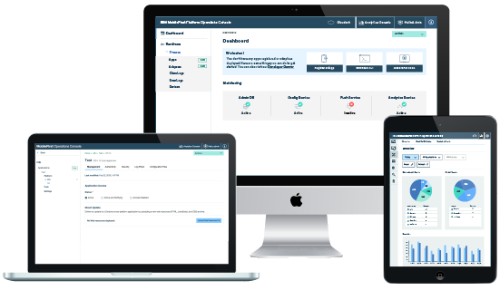

# MobileFirst Platform foundation

Discover MobileFirst Platform, Bluemix, IBM Cloud Platform, through a set of hands-on labs.

## Table of Contents

+ [Lab # 1 - Understand the Ionic application and learn how to customize it](./labs/Lab%201%20-%20Review%20Ionic%20Application%20and%20Customization)

+ [Lab # 2 - Use Cordova CLI to add the new MFP v8.0 Cordova Plugin](./labs/Lab 2 - The Cordova CLI and MFP v8.0 Cordova Plugin)

+ [Lab # 3 - Load MFP framework and application Bootstrapping](./labs/Lab 3 - Load MFP framework and application Bootstrapping)

+ [Lab # 4 - Use MFP CLI to register and manage your application](./labs/Lab 4 - Register and Manage Application)

+ [Lab # 5 - Using MFP adapters frameworks (Server Side)](./labs/Lab 5 - Implement the MFP adapter framework (Server Side))

+ [Lab # 6 - Using MFP adapters frameworks (Client side)](./labs/Lab 6 - Use the MFP adapter framework (Client side))

+ [Lab # 7 - Overview MFP Operational Analytics](./labs/Lab 7 - Overview MFP Operational Analytics)

+ [Lab # 8 - How to capture custom events](./labs/Lab 8 - How to capture custom events)

+ [Lab # 9 - How to create custom charts and alerts](./labs/Lab 9 - How to create custom charts and alerts)

+ [Lab # 10 - How to secure your application (Server side)](./labs/Lab 10 - How to secure your application (Server side))

+ [Lab # 11 - How to secure your application (Client side)](./labs/Lab 11 - How to secure your application (Client side))

# Pre-Requisites

If you run these labs on your own computer, you will need to install some softwares first. Here is a non-exhaustive list of [pre-reqs](./labs/Prerequisites).